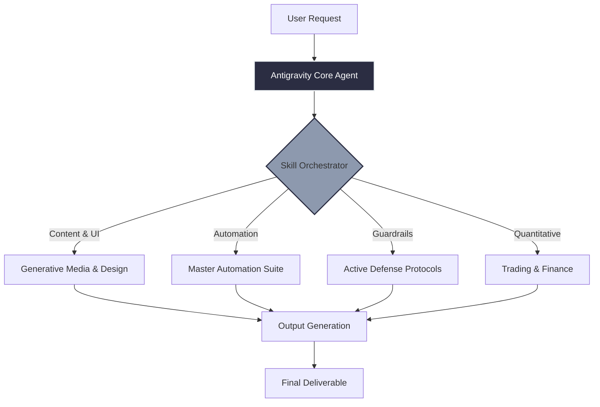

# 🚀 My Personal Agent Skills Repository
  

Welcome to my personal AI Agent Skills repository. This repository acts as a master directory of my highly-curated AI skills and documents my custom **Antigravity** configuration.

---

## 📐 Architecture Schema

Rather than keeping a bloated installation, I have customized the skill stack to focus strictly on practical workflows:

## 🏗️ Custom Skill Architecture & Combinations

My Antigravity setup utilizes specific combinations of skills to reduce context bloat and improve reasoning:

1. **The Master Automation Suite:** We merged disparate testing frameworks (`playwright-expert`, `playwright-skill`, and `webapp-testing`) into a single unified `master-automation-skill` for E2E browser tasks.
2. **Open-Design Generative Bundle:** We bundled external generative APIs (like Fal.ai and Venice for images, video, and audio) into a single `generative-media-tools` suite.
3. **Active Defense Mechanisms:** To prevent LLM hallucinations and over-engineering, we baked the **Anti-Hallucination Protocol** and the **Karpathy Guidelines Addendum** directly into the core system prompts of all active execution skills (e.g., `executing-plans`, `test-driven-development`). This forces the agent to read defensive guardrails *before* executing code changes.
4. **Data Conflict Resolution:** `funda-data` serves as the primary financial data source, while `yfinance-data` acts strictly as a fallback.

---

## 🟢 Active Skill Inventory

These skills are fully active and available for use by the agent in daily workflows (design, marketing, coding, content generation). *All sources link back to their original open-source repositories.*

| Skill Name | Description | Source |
| :--- | :--- | :--- |
| **advanced-presentations** | Suite of advanced presentation layouts including deck templates. | [Custom Bundle] |
| **affiliate-skills** | 52 AI-powered skills for affiliate marketing. | [Alireza](https://github.com/alirezarezvani/claude-skills) |
| **agent-browser** | Browser automation CLI for AI agents. | [Open-Design](https://github.com/nexu-io/open-design) |
| **ai-meeting-scribe** | AI Meeting Note-Taking Skill using WhisperX and LLM summarization. | [Alireza](https://github.com/alirezarezvani/claude-skills) |
| **algorithmic-art** | Creating algorithmic art using p5.js with seeded randomness. | [Open-Design](https://github.com/nexu-io/open-design) |
| **anthropic-pptx** | Official Claude Code PowerPoint Generator. | [Anthropic](https://github.com/anthropics/skills) |
| **artifacts-builder** | Suite of tools for creating elaborate HTML artifacts (React, Tailwind, shadcn). | [Open-Design](https://github.com/nexu-io/open-design) |
| **brainstorming** | Explores user intent, requirements and design before implementation. | [Alireza](https://github.com/alirezarezvani/claude-skills) |
| **brand-guidelines** | Applies Anthropic's official brand colors and typography to artifacts. | [Anthropic](https://github.com/anthropics/skills) |
| **brand-voice** | Maintains consistent brand tone. | [Alireza](https://github.com/alirezarezvani/claude-skills) |
| **canvas-design** | Create beautiful visual art in .png and .pdf documents. | [Open-Design](https://github.com/nexu-io/open-design) |
| **changelog-generator** | Automatically creates user-facing changelogs from git commits. | [Alireza](https://github.com/alirezarezvani/claude-skills) |
| **claude-api** | Build, debug, and optimize Claude API / Anthropic SDK apps. | [Anthropic](https://github.com/anthropics/skills) |
| **color-expert** | Color science expert skill covering palette generation and accessibility. | [Open-Design](https://github.com/nexu-io/open-design) |
| **competitive-ads-extractor**| Extracts and analyzes competitors' ads from ad libraries. | [Alireza](https://github.com/alirezarezvani/claude-skills) |
| **connect** | Connect Claude to any app (Gmail, Slack, GitHub, Notion). | [Alireza](https://github.com/alirezarezvani/claude-skills) |
| **connect-apps** | Connect Claude to external apps for actions in external services. | [Alireza](https://github.com/alirezarezvani/claude-skills) |
| **connections-optimizer** | Optimizes professional connections. | [Alireza](https://github.com/alirezarezvani/claude-skills) |
| **content-engine** | Automated content generation engine. | [Alireza](https://github.com/alirezarezvani/claude-skills) |
| **content-research-writer** | Assists in writing high-quality content with research and citations. | [Alireza](https://github.com/alirezarezvani/claude-skills) |
| **crosspost** | Formats content across platforms. | [Alireza](https://github.com/alirezarezvani/claude-skills) |
| **cs-content-creator** | AI-powered content creation specialist for brand voice consistency. | [Alireza](https://github.com/alirezarezvani/claude-skills) |
| **cs-demand-gen-specialist**| Demand generation and customer acquisition specialist. | [Alireza](https://github.com/alirezarezvani/claude-skills) |
| **data-quality-checker** | Validate data quality in market analysis documents. | [TraderMonty](https://github.com/tradermonty/claude-trading-skills) |
| **developer-growth-analysis**| Analyzes chat history to identify coding patterns and learning resources. | [Alireza](https://github.com/alirezarezvani/claude-skills) |
| **dispatching-parallel-agents**| Dispatch multiple agents for independent tasks. | [Alireza](https://github.com/alirezarezvani/claude-skills) |
| **doc-coauthoring** | Guide users through a structured workflow for co-authoring documentation. | [Anthropic](https://github.com/anthropics/skills) |
| **docx** | Create, read, edit, or manipulate Word documents (.docx files). | [Anthropic](https://github.com/anthropics/skills) |
| **domain-name-brainstormer**| Generates creative domain name ideas and checks availability. | [Alireza](https://github.com/alirezarezvani/claude-skills) |
| **drawio-skill** | Text to professional diagrams. | [Alireza](https://github.com/alirezarezvani/claude-skills) |
| **dual-axis-skill-reviewer** | Review skills using deterministic checks and LLM deep review. | [Alireza](https://github.com/alirezarezvani/claude-skills) |
| **ecc-suite** | Advanced content marketing and brand voice preservation skills. | [ECC](https://github.com/affaan-m/ECC) |
| **excalidraw-skill** | Text to hand-drawn diagrams. | [Alireza](https://github.com/alirezarezvani/claude-skills) |
| **executing-plans** | Execute written implementation plans with review checkpoints. | [Alireza](https://github.com/alirezarezvani/claude-skills) |
| **figma-implement-design** | Translate Figma designs into production-ready code. | [Open-Design](https://github.com/nexu-io/open-design) |
| **figma-use** | Run Figma Plugin API scripts for canvas writes and inspections. | [Open-Design](https://github.com/nexu-io/open-design) |
| **file-organizer** | Intelligently organizes files and folders across your computer. | [Alireza](https://github.com/alirezarezvani/claude-skills) |
| **finishing-a-development-branch**| Guides completion of development work (merge, PR, cleanup). | [Alireza](https://github.com/alirezarezvani/claude-skills) |
| **frontend-design** | Create distinctive, production-grade frontend interfaces. | [Open-Design](https://github.com/nexu-io/open-design) |
| **generative-media-tools** | Suite of generative AI tools including Fal.ai and Venice (Image/Video/Audio). | [Custom Bundle] |
| **hormuz-strait** | Check status of the Strait of Hormuz. | [Himself65](https://github.com/himself65/finance-skills) |
| **image-enhancer** | Improves the quality of images, especially screenshots. | [Alireza](https://github.com/alirezarezvani/claude-skills) |
| **internal-comms** | Resources to write internal communications (status reports, FAQs). | [Alireza](https://github.com/alirezarezvani/claude-skills) |
| **invoice-organizer** | Automatically organizes invoices and receipts for tax preparation. | [Alireza](https://github.com/alirezarezvani/claude-skills) |
| **langsmith-fetch** | Debug LangChain and LangGraph agents by fetching execution traces. | [Alireza](https://github.com/alirezarezvani/claude-skills) |
| **lead-research-assistant** | Identifies high-quality leads for your product or service. | [Alireza](https://github.com/alirezarezvani/claude-skills) |
| **market-research** | Market analysis tool. | [TraderMonty](https://github.com/tradermonty/claude-trading-skills) |
| **master-automation-skill** | Unified Master Automation Skill for Playwright. Combines JS and Python testing. | [Custom Bundle] |
| **mc-agent-toolkit** | Data observability, lineage, monitoring. | [Alireza](https://github.com/alirezarezvani/claude-skills) |
| **mcp-builder** | Guide for creating high-quality MCP servers. | [Alireza](https://github.com/alirezarezvani/claude-skills) |
| **meeting-insights-analyzer**| Analyzes meeting transcripts and recordings for behavioral patterns. | [Alireza](https://github.com/alirezarezvani/claude-skills) |
| **nanobanana-ppt** | AI-powered PPT generation with structured deck output. | [Open-Design](https://github.com/nexu-io/open-design) |
| **pdf** | Read, extract, combine, split, watermark, and OCR PDF files. | [Anthropic](https://github.com/anthropics/skills) |
| **perplexity-follow-up** | Suggest relevant follow-up questions at the end of responses. | [Alireza](https://github.com/alirezarezvani/claude-skills) |
| **ppt-keynote** | Apple Keynote-quality slides with keyboard navigation. | [Open-Design](https://github.com/nexu-io/open-design) |
| **pptagent-v2** | End-to-End AI Presentation System with Research & Visuals. | [ComposioHQ](https://github.com/ComposioHQ/awesome-claude-skills) |
| **pptx** | Any .pptx file operations (creating, reading, editing). | [Anthropic](https://github.com/anthropics/skills) |
| **pptx-generator** | Create and edit PowerPoint presentations from scratch. | [Open-Design](https://github.com/nexu-io/open-design) |
| **product-manager-skills** | PM operator for AI tools. | [Alireza](https://github.com/alirezarezvani/claude-skills) |
| **raffle-winner-picker** | Picks random winners from lists or spreadsheets. | [Alireza](https://github.com/alirezarezvani/claude-skills) |
| **receiving-code-review** | Rigorous verification of code review feedback. | [Alireza](https://github.com/alirezarezvani/claude-skills) |
| **requesting-code-review** | Verification of work before merging. | [Alireza](https://github.com/alirezarezvani/claude-skills) |
| **seo-optimizer** | Search Engine Optimization analysis. | [Alireza](https://github.com/alirezarezvani/claude-skills) |
| **shadcn-ui** | Build UI components with shadcn/ui. | [Open-Design](https://github.com/nexu-io/open-design) |
| **sharp** | Process images with the Sharp library for Node.js. | [Clasen](https://github.com/clasen/Skills) |
| **skill-creator** | Create, modify, and improve existing skills. | [Alireza](https://github.com/alirezarezvani/claude-skills) |
| **skill-designer** | Design new Claude skills from structured idea specifications. | [TraderMonty](https://github.com/tradermonty/claude-trading-skills) |
| **skill-idea-miner** | Mine session logs for skill idea candidates. | [TraderMonty](https://github.com/tradermonty/claude-trading-skills) |
| **skill-integration-tester** | Validate multi-skill workflows. | [TraderMonty](https://github.com/tradermonty/claude-trading-skills) |
| **skill-share** | Automatically shares new Claude skills on Slack. | [Alireza](https://github.com/alirezarezvani/claude-skills) |
| **slack-gif-creator** | Creates animated GIFs optimized for Slack. | [Alireza](https://github.com/alirezarezvani/claude-skills) |
| **slides** | Create and edit .pptx presentation decks. | [Open-Design](https://github.com/nexu-io/open-design) |
| **social-media-content-engine**| Content engine for social media platforms. | [Alireza](https://github.com/alirezarezvani/claude-skills) |
| **speech** | Generate spoken audio from text using OpenAI's API. | [Open-Design](https://github.com/nexu-io/open-design) |
| **startup-analysis** | Analyze a startup from VC, applicant, and founder perspectives. | [Himself65](https://github.com/himself65/finance-skills) |
| **stop-slop** | Remove AI writing patterns from prose. | [HardikPandya](https://github.com/hardikpandya/stop-slop) |
| **subagent-driven-development**| Executing implementation plans with independent tasks. | [Alireza](https://github.com/alirezarezvani/claude-skills) |
| **systematic-debugging** | Systematic bug fixing and unexpected behavior resolution. | [Alireza](https://github.com/alirezarezvani/claude-skills) |
| **tailored-resume-generator**| Analyzes job descriptions to generate tailored resumes. | [Alireza](https://github.com/alirezarezvani/claude-skills) |
| **template-skill** | Template for creating new skills. | [Custom] |
| **test-driven-development** | Implement features with test-driven development. | [Alireza](https://github.com/alirezarezvani/claude-skills) |
| **the-council** | Convene a four-voice council for ambiguous decisions. | [Custom] |
| **theme-factory** | Toolkit for styling artifacts with themes. | [Open-Design](https://github.com/nexu-io/open-design) |
| **token-budget-advisor** | Controls response length and depth token budget. | [ECC](https://github.com/affaan-m/ECC) |
| **twitter-algorithm-optimizer**| Analyze and optimize tweets for maximum reach. | [Alireza](https://github.com/alirezarezvani/claude-skills) |
| **using-git-worktrees** | Starts feature work in isolated workspaces. | [Alireza](https://github.com/alirezarezvani/claude-skills) |
| **using-superpowers** | Establishes how to find and use skills. | [Obra](https://github.com/obra/superpowers) |
| **verification-before-completion**| Runs verification commands before claiming success. | [Alireza](https://github.com/alirezarezvani/claude-skills) |
| **video-downloader** | Download YouTube videos with customizable quality and format options. | [Custom] |
| **viralcutter** | Open-source alternative to Opus Clip. Turns long videos into viral shorts. | [RafaelGodoyEbert](https://github.com/RafaelGodoyEbert/ViralCutter) |
| **web-artifacts-builder** | Suite of tools for creating elaborate HTML artifacts. | [Open-Design](https://github.com/nexu-io/open-design) |
| **writing-plans** | Spec and requirements processing for multi-step tasks. | [Alireza](https://github.com/alirezarezvani/claude-skills) |
| **writing-skills** | Creating, editing, and verifying skills. | [Alireza](https://github.com/alirezarezvani/claude-skills) |
| **xlsx** | Spreadsheet creation, editing, and formatting. | [Anthropic](https://github.com/anthropics/skills) |
| **youtube-clipper** | AI-powered YouTube video clipper and subtitle translation. | [op7418](https://github.com/op7418/Youtube-clipper) |

---

## ❄️ Frozen Skills (Financial & Swing Trading)

To protect the context window and prevent irrelevant agent triggering, all financial and trading skills have been actively marked as `[FROZEN]`. The system ignores them, but the files are preserved for future quant workflows.

<b>🖱️ Click to expand Frozen Skills List</b>

*   `backtest-expert`
*   `breadth-chart-analyst`
*   `breakout-trade-planner`
*   `canslim-screener`
*   `company-valuation`
*   `dividend-growth-pullback-screener`
*   `downtrend-duration-analyzer`
*   `earnings-calendar`
*   `earnings-preview`
*   `earnings-recap`
*   `earnings-trade-analyzer`
*   `economic-calendar-fetcher`
*   `edge-candidate-agent`
*   `edge-concept-synthesizer`
*   `edge-hint-extractor`
*   `edge-pipeline-orchestrator`
*   `edge-signal-aggregator`
*   `edge-strategy-designer`
*   `edge-strategy-reviewer`
*   `estimate-analysis`
*   `etf-premium`
*   `exposure-coach`
*   `finance-sentiment`
*   `finviz-screener`
*   `ftd-detector`
*   `funda-data` *(Primary fundamental source)*
*   `ibd-distribution-day-monitor`
*   `institutional-flow-tracker`
*   `macro-regime-detector`
*   `market-breadth-analyzer`
*   `market-environment-analysis`
*   `market-news-analyst`
*   `market-top-detector`
*   `options-payoff`
*   `options-strategy-advisor`
*   `pair-trade-screener`
*   `parabolic-short-trade-planner`
*   `pead-screener`
*   `portfolio-manager`
*   `position-sizer`
*   `saas-valuation-compression`
*   `scenario-analyzer`
*   `sector-analyst`
*   `sepa-strategy`
*   `signal-postmortem`
*   `stanley-druckenmiller-investment`
*   `stock-correlation`
*   `stock-liquidity`
*   `strategy-pivot-designer`
*   `technical-analyst`
*   `theme-detector`
*   `trade-hypothesis-ideator`
*   `trade-performance-coach`
*   `trader-memory-core`
*   `trading-skills-navigator`
*   `tradingview-reader`
*   `uptrend-analyzer`
*   `us-market-bubble-detector`
*   `us-stock-analysis`
*   `value-dividend-screener`
*   `vcp-screener`
*   `yfinance-data` *(Fallback data source)*

---

## 📜 Credits & Tributes
This repository is a heavily curated and opinionated assembly of open-source work. Full tribute, credit, and massive appreciation go to the original creators who engineered these skills:

*   **[TraderMonty (claude-trading-skills)](https://github.com/tradermonty/claude-trading-skills)**
*   **[Alireza Rezvani (claude-skills)](https://github.com/alirezarezvani/claude-skills)**
*   **[Himself65 (finance-skills)](https://github.com/himself65/finance-skills)**
*   **[Anthropic (skills)](https://github.com/anthropics/skills)**
*   **[Nexu-io (open-design)](https://github.com/nexu-io/open-design)**
*   **[ComposioHQ (awesome-claude-skills)](https://github.com/ComposioHQ/awesome-claude-skills)**
*   **[Pedro Clasen (Skills)](https://github.com/clasen/Skills)**
*   **[ECC (token-budget-advisor)](https://github.com/affaan-m/ECC)**

**Review & Audit:** All skills in this repository were rigorously audited by the multi-agent *The Council* protocol for security, backdoors, and logic validation.  
**Engine:** Powered by Google DeepMind's Antigravity framework.
