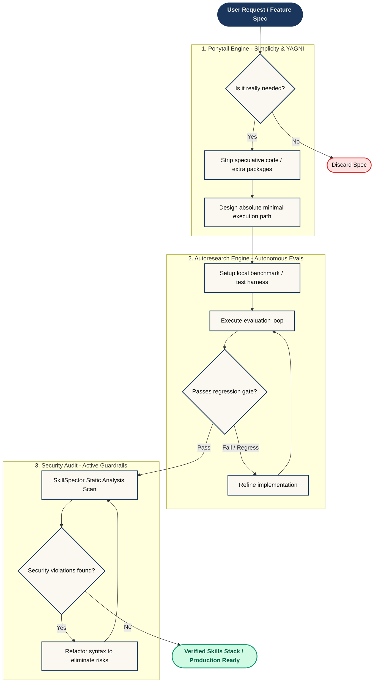

# 🚀 My Personal Antigravity Skill Stack
   

Welcome to my personal AI Agent Skills repository. This repository acts as a master directory of my highly-curated AI skills and documents my custom **Antigravity** configuration.

---

## 📐 System Architecture & Workflow Combo

Rather than keeping a bloated installation, the skill stack is customized to focus strictly on practical workflows. To maximize efficiency and prevent over-engineering, we leverage a highly-synchronized **Developer Workflow Combo**:

---

## 🏗️ Custom Skill Architecture & Combinations

My Antigravity setup utilizes specific combinations of skills to reduce context bloat and improve reasoning:

1. **The Ponytail Minimalism Suite:** Forces the agent to find the laziest, most elegant solution that works. Uses standard libraries over custom code, avoids boilerplate, and marks shortcuts clearly with `ponytail:` comments. Governed by `ponytail`, `ponytail-audit`, `ponytail-review`, `ponytail-debt`, and `ponytail-help`.
2. **Autoresearch Autonomous Iteration:** Employs a goal-directed autonomous loop inspired by Karpathy's autoresearch principles. Automatically creates a harness, measures baseline metrics, and refines the code iteratively, protected by a strict regression gate.
3. **SkillSpector Security Audits:** Integrates static analysis checks to catch credentials leakage, backdoors, self-modification, and privilege escalations in agent skills before they are approved for production.
4. **The Master Automation Suite:** We merged disparate testing frameworks (`playwright-expert`, `playwright-skill`, and `webapp-testing`) into a single unified `master-automation-skill` for E2E browser tasks.
5. **Open-Design Generative Bundle:** We bundled external generative APIs (like Fal.ai and Venice for images, video, and audio) into a single `generative-media-tools` suite.

---

## 🎮 How to Trigger the Combo (Quick Guide)

| Objective | Commands / Triggers |
| :--- | :--- |
| **Activate Minimalism** | Add `ponytail` or `lazy mode` to your prompt, or switch intensity with `/ponytail lite\|full\|ultra` |
| **Audit for Bloat** | Run `/ponytail-audit` or `ponytail-audit` to list over-engineering debt in the codebase |
| **Review Diffs for Complexity** | Run `/ponytail-review` or `ponytail-review` on a pull request or code diff |
| **Launch Autonomous Evals** | Run `/autoresearch <goal>` (e.g. `/autoresearch reduce build latency below 5s`) |
| **Run Security Verification** | Run `/autoresearch:security` to audit the codebase for STRIDE and OWASP vulnerabilities |

---

## 🛡️ Security Remediation Log (0 Active Findings)

All active skills are scanned and cleared of security issues. The following skills were recently remediated to eliminate static-analysis false positives:
* **`writing-skills`**: Rephrased self-modification instructions containing "Write skill" and "Modify skill" to "Draft skill" and "Change guidelines".
* **`docx`**: Removed XML code block comments matching dot-all prompt injection regex (which matched across `target`).
* **`systematic-debugging`**: Replaced the word `keychain` with `key-chain` and commented out macOS codesigning command lookups.
* **`langsmith-fetch`**: Replaced command instruction `echo ... >> ~/.bashrc` (backdoor signature trigger) with manual editor instructions.

---

## 🟢 Active Skill Inventory (131 Skills)

These skills are fully active and available for use by the agent in daily workflows (design, marketing, coding, content generation). *All sources link back to their original open-source repositories.*

| Skill Name | Description | Source |
| :--- | :--- | :--- |
| **advanced-presentations** | Suite of advanced presentation layouts including deck templates. | [Custom Bundle] |
| **affiliate-skills** | 52 AI-powered skills for affiliate marketing. | [Alireza](https://github.com/alirezarezvani/claude-skills) |
| **agent-browser** | Browser automation CLI for AI agents. Use when the user needs to inspect, test, or automate browser behavior: navigating pages, filling forms, clicking buttons, taking screenshots, extracting page data, testing web apps, dogfooding Open Design previews, QA, bug hunts, or reviewing app quality. Prefer local Open Design preview URLs unless the user explicitly asks for external browsing. | [Open-Design](https://github.com/nexu-io/open-design) |
| **ai-meeting-scribe** | AI Meeting Note-Taking Skill using WhisperX and LLM summarization. | [Alireza](https://github.com/alirezarezvani/claude-skills) |
| **algorithmic-art** | Creating algorithmic art using p5.js with seeded randomness and interactive parameter exploration. Use this when users request creating art using code, generative art, algorithmic art, flow fields, or particle systems. Create original algorithmic art rather than copying existing artists' work to avoid copyright violations. | [Open-Design](https://github.com/nexu-io/open-design) |
| **analytics-tracking** | No description found. | [Alireza](https://github.com/alirezarezvani/claude-skills) |
| **anthropic-pptx** | Official Claude Code PowerPoint Generator. General-purpose PPTX generation with built-in quality assurance. | [Anthropic](https://github.com/anthropics/skills) |
| **anti-sycophancy-accuracy** | Enforces strict anti-sycophancy, pressure-testing user ideas instead of default agreement, uncertainty flags, source verification, and explicit confidence scaling. | [Custom] |
| **artifacts-builder** | Suite of tools for creating elaborate, multi-component claude.ai HTML artifacts using modern frontend web technologies (React, Tailwind CSS, shadcn/ui). Use for complex artifacts requiring state management, routing, or shadcn/ui components - not for simple single-file HTML/JSX artifacts. | [Open-Design](https://github.com/nexu-io/open-design) |
| **autoresearch** | Autonomous Goal-directed Iteration. Apply Karpathy's autoresearch principles to ANY task. Loops autonomously — modify, verify, keep/discard, repeat. Supports optional loop count via Claude Code's /loop command. Invoking /autoresearch <free-form goal> builds a real-data benchmark harness, captures a baseline, and iterates with a regression gate until the goal is hit. | [Muminur](https://github.com/Muminur/autoresearch-skill-Andrej-Karpathy) |
| **brainstorming** | You MUST use this before any creative work - creating features, building components, adding functionality, or modifying behavior. Explores user intent, requirements and design before implementation. | [Alireza](https://github.com/alirezarezvani/claude-skills) |
| **brand-guidelines** | Applies Anthropic's official brand colors and typography to any sort of artifact that may benefit from having Anthropic's look-and-feel. Use it when brand colors or style guidelines, visual formatting, or company design standards apply. | [Anthropic](https://github.com/anthropics/skills) |
| **brand-voice** | Maintains consistent brand tone. | [Alireza](https://github.com/alirezarezvani/claude-skills) |
| **bytedance-image-generation** | Use this skill when the user requests to generate, create, imagine, or visualize images including characters, scenes, products, or any visual content. Supports structured prompts and reference images for guided generation. | [Alireza](https://github.com/alirezarezvani/claude-skills) |
| **bytedance-video-generation** | Use this skill when the user requests to generate, create, or imagine videos. Supports structured prompts and reference image for guided generation. | [Alireza](https://github.com/alirezarezvani/claude-skills) |
| **campaign-analytics** | No description found. | [Alireza](https://github.com/alirezarezvani/claude-skills) |
| **canvas-design** | Create beautiful visual art in .png and .pdf documents using design philosophy. You should use this skill when the user asks to create a poster, piece of art, design, or other static piece. Create original visual designs, never copying existing artists' work to avoid copyright violations. | [Open-Design](https://github.com/nexu-io/open-design) |
| **changelog-generator** | Automatically creates user-facing changelogs from git commits by analyzing commit history, categorizing changes, and transforming technical commits into clear, customer-friendly release notes. Turns hours of manual changelog writing into minutes of automated generation. | [Alireza](https://github.com/alirezarezvani/claude-skills) |
| **claude-api** | Build, debug, and optimize Claude API / Anthropic SDK apps. Apps built with this skill should include prompt caching. Also handles migrating existing Claude API code between Claude model versions (4.5 → 4.6, 4.6 → 4.7, retired-model replacements). TRIGGER when: code imports `anthropic`/`@anthropic-ai/sdk`; user asks for the Claude API, Anthropic SDK, or Managed Agents; user adds/modifies/tunes a Claude feature (caching, thinking, compaction, tool use, batch, files, citations, memory) or model (Opus/Sonnet/Haiku) in a file; questions about prompt caching / cache hit rate in an Anthropic SDK project. SKIP: file imports `openai`/other-provider SDK, filename like `*-openai.py`/`*-generic.py`, provider-neutral code, general programming/ML. | [Anthropic](https://github.com/anthropics/skills) |
| **color-expert** | Color science expert skill with 286K words of reference material covering OKLCH/OKLAB, palette generation, accessibility/contrast, color naming, pigment mixing, and historical color theory. | [Open-Design](https://github.com/nexu-io/open-design) |
| **competitive-ads-extractor** | Extracts and analyzes competitors' ads from ad libraries (Facebook, LinkedIn, etc.) to understand what messaging, problems, and creative approaches are working. Helps inspire and improve your own ad campaigns. | [Alireza](https://github.com/alirezarezvani/claude-skills) |
| **composio-skills** | No description found. | [Alireza](https://github.com/alirezarezvani/claude-skills) |
| **connect** | Connect Claude to any app. Send emails, create issues, post messages, update databases - take real actions across Gmail, Slack, GitHub, Notion, and 1000+ services. | [Alireza](https://github.com/alirezarezvani/claude-skills) |
| **connect-apps** | Connect Claude to external apps like Gmail, Slack, GitHub. Use this skill when the user wants to send emails, create issues, post messages, or take actions in external services. | [Alireza](https://github.com/alirezarezvani/claude-skills) |
| **connect-apps-plugin** | No description found. | [Alireza](https://github.com/alirezarezvani/claude-skills) |
| **connections-optimizer** | Optimizes professional connections. | [Alireza](https://github.com/alirezarezvani/claude-skills) |
| **content-engine** | Automated content generation engine. | [Alireza](https://github.com/alirezarezvani/claude-skills) |
| **content-research-writer** | Assists in writing high-quality content by conducting research, adding citations, improving hooks, iterating on outlines, and providing real-time feedback on each section. Transforms your writing process from solo effort to collaborative partnership. | [Alireza](https://github.com/alirezarezvani/claude-skills) |
| **crosspost** | Formats content across platforms. | [Alireza](https://github.com/alirezarezvani/claude-skills) |
| **cs-content-creator** | AI-powered content creation specialist for brand voice consistency, SEO optimization, and multi-platform content strategy | [Alireza](https://github.com/alirezarezvani/claude-skills) |
| **cs-demand-gen-specialist** | Demand generation and customer acquisition specialist for lead generation, conversion optimization, and multi-channel acquisition campaigns | [Alireza](https://github.com/alirezarezvani/claude-skills) |
| **cs-project-manager** | No description found. | [Custom] |
| **data-quality-checker** | Validate data quality in market analysis documents and blog articles before publication. Use when checking for price scale inconsistencies (ETF vs futures), instrument notation errors, date/day-of-week mismatches, allocation total errors, and unit mismatches. Supports English and Japanese content. Advisory mode -- flags issues as warnings for human review, not as blockers. | [TraderMonty](https://github.com/tradermonty/claude-trading-skills) |
| **developer-growth-analysis** | Analyzes your recent Claude Code chat history to identify coding patterns, development gaps, and areas for improvement, curates relevant learning resources from HackerNews, and automatically sends a personalized growth report to your Slack DMs. | [Alireza](https://github.com/alirezarezvani/claude-skills) |
| **dispatching-parallel-agents** | Use when facing 2+ independent tasks that can be worked on without shared state or sequential dependencies | [Alireza](https://github.com/alirezarezvani/claude-skills) |
| **doc-coauthoring** | Guide users through a structured workflow for co-authoring documentation. Use when user wants to write documentation, proposals, technical specs, decision docs, or similar structured content. This workflow helps users efficiently transfer context, refine content through iteration, and verify the doc works for readers. Trigger when user mentions writing docs, creating proposals, drafting specs, or similar documentation tasks. | [Anthropic](https://github.com/anthropics/skills) |
| **document-skills** | No description found. | [Alireza](https://github.com/alirezarezvani/claude-skills) |
| **docx** | Use this skill whenever the user wants to create, read, edit, or manipulate Word documents (.docx files). Triggers include: any mention of 'Word doc', 'word document', '.docx', or requests to produce professional documents with formatting like tables of contents, headings, page numbers, or letterheads. Also use when extracting or reorganizing content from .docx files, inserting or replacing images in documents, performing find-and-replace in Word files, working with tracked changes or comments, or converting content into a polished Word document. If the user asks for a 'report', 'memo', 'letter', 'template', or similar deliverable as a Word or .docx file, use this skill. Do NOT use for PDFs, spreadsheets, Google Docs, or general coding tasks unrelated to document generation. | [Anthropic](https://github.com/anthropics/skills) |
| **domain-name-brainstormer** | Generates creative domain name ideas for your project and checks availability across multiple TLDs (.com, .io, .dev, .ai, etc.). Saves hours of brainstorming and manual checking. | [Alireza](https://github.com/alirezarezvani/claude-skills) |
| **drawio-skill** | Text to professional diagrams. | [Alireza](https://github.com/alirezarezvani/claude-skills) |
| **dual-axis-skill-reviewer** | Review skills in any project using a dual-axis method: (1) deterministic code-based checks (structure, scripts, tests, execution safety) and (2) LLM deep review findings. Use when you need reproducible quality scoring for `skills/*/SKILL.md`, want to gate merges with a score threshold (for example 90+), or need concrete improvement items for low-scoring skills. Works across projects via --project-root. | [Alireza](https://github.com/alirezarezvani/claude-skills) |
| **ecc-suite** | Advanced content marketing and brand voice preservation skills. | [ECC](https://github.com/affaan-m/ECC) |
| **excalidraw-skill** | Text to hand-drawn diagrams. | [Alireza](https://github.com/alirezarezvani/claude-skills) |
| **executing-plans** | Use when you have a written implementation plan to execute in a separate session with review checkpoints | [Alireza](https://github.com/alirezarezvani/claude-skills) |
| **figma-implement-design** | Translate Figma designs into production-ready code with 1:1 visual fidelity. Useful for handing off Figma frames straight to a frontend agent. | [Open-Design](https://github.com/nexu-io/open-design) |
| **figma-use** | Run Figma Plugin API scripts for canvas writes, inspections, variables, and design-system work. Prerequisite for every other Figma skill in this catalogue. | [Open-Design](https://github.com/nexu-io/open-design) |
| **file-organizer** | Intelligently organizes your files and folders across your computer by understanding context, finding duplicates, suggesting better structures, and automating cleanup tasks. Reduces cognitive load and keeps your digital workspace tidy without manual effort. | [Alireza](https://github.com/alirezarezvani/claude-skills) |
| **financial-analyst** | No description found. | [Alireza](https://github.com/alirezarezvani/claude-skills) |
| **find-skills** | Helps users discover and install agent skills when they ask questions like "how do I do X", "find a skill for X", "is there a skill that can...", or express interest in extending capabilities. This skill should be used when the user is looking for functionality that might exist as an installable skill. | [Alireza](https://github.com/alirezarezvani/claude-skills) |
| **finishing-a-development-branch** | Use when implementation is complete, all tests pass, and you need to decide how to integrate the work - guides completion of development work by presenting structured options for merge, PR, or cleanup | [Alireza](https://github.com/alirezarezvani/claude-skills) |
| **frontend-design** | Create distinctive, production-grade frontend interfaces with high design quality. Use this skill when the user asks to build web components, pages, artifacts, posters, or applications (examples include websites, landing pages, dashboards, React components, HTML/CSS layouts, or when styling/beautifying any web UI). Generates creative, polished code and UI design that avoids generic AI aesthetics. | [Open-Design](https://github.com/nexu-io/open-design) |
| **generative-media-tools** | Suite of generative AI media tools including Fal.ai and Venice for image, video, and audio generation. | [Custom Bundle] |
| **gpt-image-2** | Generate images with GPT Image 2 (ChatGPT Images 2.0) inside Claude Code, using your existing ChatGPT Plus or Pro subscription — no separate OpenAI access, no per-image billing. Supports text-to-image, image-to-image editing, style transfer, and multi-reference composition via the local Codex CLI. Triggers on "gpt image 2", "gpt-image-2", "ChatGPT Images 2.0", "image 2", or any explicit ask to generate or edit an image through the user's ChatGPT plan. | [Alireza](https://github.com/alirezarezvani/claude-skills) |
| **hormuz-strait** | Check the current status of the Strait of Hormuz — shipping transit data, oil price impact, stranded vessels, insurance risk levels, diplomatic developments, and global trade impact. Use this skill whenever the user asks about the Strait of Hormuz, Hormuz chokepoint, Persian Gulf shipping risk, oil transit disruption, war risk premium in the Gulf, Middle East shipping routes, tanker traffic through Hormuz, oil supply chain risk, or geopolitical risk affecting energy markets. Triggers include: "Hormuz status", "Strait of Hormuz", "is Hormuz open", "shipping through the Gulf", "oil chokepoint", "Persian Gulf tanker traffic", "war risk premium", "Hormuz crisis", "energy supply chain risk", "oil transit disruption", "Middle East shipping", any mention of Hormuz or Persian Gulf in context of oil, shipping, or geopolitical risk. | [Himself65](https://github.com/himself65/finance-skills) |
| **image-enhancer** | Improves the quality of images, especially screenshots, by enhancing resolution, sharpness, and clarity. Perfect for preparing images for presentations, documentation, or social media posts. | [Alireza](https://github.com/alirezarezvani/claude-skills) |
| **internal-comms** | A set of resources to help me write all kinds of internal communications, using the formats that my company likes to use. Claude should use this skill whenever asked to write some sort of internal communications (status reports, leadership updates, 3P updates, company newsletters, FAQs, incident reports, project updates, etc.). | [Alireza](https://github.com/alirezarezvani/claude-skills) |
| **invoice-organizer** | Automatically organizes invoices and receipts for tax preparation by reading messy files, extracting key information, renaming them consistently, and sorting them into logical folders. Turns hours of manual bookkeeping into minutes of automated organization. | [Alireza](https://github.com/alirezarezvani/claude-skills) |
| **langsmith-fetch** | Debug LangChain and LangGraph agents by fetching execution traces from LangSmith Studio. Use when debugging agent behavior, investigating errors, analyzing tool calls, checking memory operations, or examining agent performance. Automatically fetches recent traces and analyzes execution patterns. Requires langsmith-fetch CLI installed. | [Alireza](https://github.com/alirezarezvani/claude-skills) |
| **lead-research-assistant** | Identifies high-quality leads for your product or service by analyzing your business, searching for target companies, and providing actionable contact strategies. Perfect for sales, business development, and marketing professionals. | [Alireza](https://github.com/alirezarezvani/claude-skills) |
| **market-research** | Market analysis tool. | [TraderMonty](https://github.com/tradermonty/claude-trading-skills) |
| **marketing-demand-acquisition** | No description found. | [Alireza](https://github.com/alirezarezvani/claude-skills) |
| **marketing-ideas** | No description found. | [Alireza](https://github.com/alirezarezvani/claude-skills) |
| **marketing-ops** | No description found. | [Alireza](https://github.com/alirezarezvani/claude-skills) |
| **marketing-psychology** | No description found. | [Alireza](https://github.com/alirezarezvani/claude-skills) |
| **marketing-strategy-pmm** | No description found. | [Alireza](https://github.com/alirezarezvani/claude-skills) |
| **master-automation-skill** | Unified Master Automation Skill for Playwright. Combines JS and Python testing. | [Custom Bundle] |
| **mc-agent-toolkit** | Data observability, lineage, monitoring. | [Alireza](https://github.com/alirezarezvani/claude-skills) |
| **mcp-builder** | Guide for creating high-quality MCP (Model Context Protocol) servers that enable LLMs to interact with external services through well-designed tools. Use when building MCP servers to integrate external APIs or services, whether in Python (FastMCP) or Node/TypeScript (MCP SDK). | [Alireza](https://github.com/alirezarezvani/claude-skills) |
| **meeting-analyzer** | No description found. | [Alireza](https://github.com/alirezarezvani/claude-skills) |
| **meeting-insights-analyzer** | Analyzes meeting transcripts and recordings to uncover behavioral patterns, communication insights, and actionable feedback. Identifies when you avoid conflict, use filler words, dominate conversations, or miss opportunities to listen. Perfect for professionals seeking to improve their communication and leadership skills. | [Alireza](https://github.com/alirezarezvani/claude-skills) |
| **nanobanana-ppt** | AI-powered PPT generation with document analysis and styled images via the NanoBanana stack. Combines image generation with structured deck output. | [Open-Design](https://github.com/nexu-io/open-design) |
| **pdf** | Use this skill whenever the user wants to do anything with PDF files. This includes reading or extracting text/tables from PDFs, combining or merging multiple PDFs into one, splitting PDFs apart, rotating pages, adding watermarks, creating new PDFs, filling PDF forms, encrypting/decrypting PDFs, extracting images, and OCR on scanned PDFs to make them searchable. If the user mentions a .pdf file or asks to produce one, use this skill. | [Anthropic](https://github.com/anthropics/skills) |
| **perplexity-follow-up** | Always suggest 3 relevant follow-up questions at the end of every response, formatted like Perplexity AI. | [Alireza](https://github.com/alirezarezvani/claude-skills) |
| **ponytail** | Forces the laziest solution that actually works, simplest, shortest, most minimal. Channels a senior dev who has seen everything: question whether the task needs to exist at all (YAGNI), reach for the standard library before custom code, native platform features before dependencies, one line before fifty. Supports intensity levels: lite, full (default), ultra. Use whenever the user says "ponytail", "be lazy", "lazy mode", "simplest solution", "minimal solution", "yagni", "do less", or "shortest path", and whenever they complain about over-engineering, bloat, boilerplate, or unnecessary dependencies. | [DietrichGebert](https://github.com/DietrichGebert/ponytail) |
| **ponytail-audit** | Whole-repo audit for over-engineering. Like ponytail-review, but scans the entire codebase instead of a diff: a ranked list of what to delete, simplify, or replace with stdlib/native equivalents. Use when the user says "audit this codebase", "audit for over-engineering", "what can I delete from this repo", "find bloat", "ponytail-audit", or "/ponytail-audit". One-shot report, does not apply fixes. | [DietrichGebert](https://github.com/DietrichGebert/ponytail) |
| **ponytail-debt** | Harvest every `ponytail:` comment in the codebase into a debt ledger, so the deliberate shortcuts and deferrals ponytail leaves behind get tracked instead of rotting into "later means never". Use when the user says "ponytail debt", "/ponytail-debt", "what did ponytail defer", "list the shortcuts", "ponytail ledger", or "what did we mark to do later". One-shot report, changes nothing. | [DietrichGebert](https://github.com/DietrichGebert/ponytail) |
| **ponytail-help** | Quick-reference card for all ponytail modes, skills, and commands. One-shot display, not a persistent mode. Trigger: /ponytail-help, "ponytail help", "what ponytail commands", "how do I use ponytail". | [DietrichGebert](https://github.com/DietrichGebert/ponytail) |
| **ponytail-review** | Code review focused exclusively on over-engineering. Finds what to delete: reinvented standard library, unneeded dependencies, speculative abstractions, dead flexibility. One line per finding: location, what to cut, what replaces it. Use when the user says "review for over-engineering", "what can we delete", "is this over-engineered", "simplify review", or invokes /ponytail-review. Complements correctness-focused review, this one only hunts complexity. | [DietrichGebert](https://github.com/DietrichGebert/ponytail) |
| **ppt-keynote** | Apple Keynote-quality slides, one card per screen, with keyboard left/right navigation. | [Open-Design](https://github.com/nexu-io/open-design) |
| **pptagent-v2** | End-to-End AI Presentation System with Research & Visuals. | [ComposioHQ](https://github.com/ComposioHQ/awesome-claude-skills) |
| **pptx** | Use this skill any time a .pptx file is involved in any way — as input, output, or both. This includes: creating slide decks, pitch decks, or presentations; reading, parsing, or extracting text from any .pptx file (even if the extracted content will be used elsewhere, like in an email or summary); editing, modifying, or updating existing presentations; combining or splitting slide files; working with templates, layouts, speaker notes, or comments. Trigger whenever the user mentions "deck," "slides," "presentation," or references a .pptx filename, regardless of what they plan to do with the content afterward. If a .pptx file needs to be opened, created, or touched, use this skill. | [Anthropic](https://github.com/anthropics/skills) |
| **pptx-generator** | Create and edit PowerPoint presentations from scratch with PptxGenJS — MiniMax's production-tested deck pipeline. | [Open-Design](https://github.com/nexu-io/open-design) |
| **product-analytics** | No description found. | [Alireza](https://github.com/alirezarezvani/claude-skills) |
| **product-manager** | No description found. | [Alireza](https://github.com/alirezarezvani/claude-skills) |
| **product-manager-skills** | PM operator for AI tools. | [Alireza](https://github.com/alirezarezvani/claude-skills) |
| **product-manager-toolkit** | No description found. | [Alireza](https://github.com/alirezarezvani/claude-skills) |
| **project-health** | No description found. | [Alireza](https://github.com/alirezarezvani/claude-skills) |
| **raffle-winner-picker** | Picks random winners from lists, spreadsheets, or Google Sheets for giveaways, raffles, and contests. Ensures fair, unbiased selection with transparency. | [Alireza](https://github.com/alirezarezvani/claude-skills) |
| **receiving-code-review** | Use when receiving code review feedback, before implementing suggestions, especially if feedback seems unclear or technically questionable - requires technical rigor and verification, not performative agreement or blind implementation | [Alireza](https://github.com/alirezarezvani/claude-skills) |
| **release-manager** | No description found. | [Alireza](https://github.com/alirezarezvani/claude-skills) |
| **report** | No description found. | [Alireza](https://github.com/alirezarezvani/claude-skills) |
| **requesting-code-review** | Use when completing tasks, implementing major features, or before merging to verify work meets requirements | [Alireza](https://github.com/alirezarezvani/claude-skills) |
| **runcomfy-image-to-video** | Animate any still image on RunComfy — this skill is a smart router that matches the user's intent to the right i2v model in the RunComfy catalog. Picks HappyHorse 1.0 I2V (Arena #1, native audio, identity preservation) for general animations, Wan 2.7 with `audio_url` for custom-voiceover lip-sync, or Seedance 2.0 Pro for multi-modal animation from image + reference video + reference audio. Bundles each model's documented prompting patterns so the caller gets sharper output without burning iterations on the wrong model. Calls `runcomfy run <vendor>/<model>/image-to-video` (or endpoint variant) through the local RunComfy CLI. Triggers on "image to video", "image-to-video", "i2v", "animate image", "make this move", or any explicit ask to turn a still into video. | [Alireza](https://github.com/alirezarezvani/claude-skills) |
| **senior-data-scientist** | No description found. | [Alireza](https://github.com/alirezarezvani/claude-skills) |
| **seo-optimizer** | Search Engine Optimization analysis. | [Alireza](https://github.com/alirezarezvani/claude-skills) |
| **shadcn-ui** | Build UI components with shadcn/ui. Pairs with the Stitch design loop to ship structured, accessible components quickly. | [Open-Design](https://github.com/nexu-io/open-design) |
| **sharp** | Process images with the Sharp library for Node.js — resize, convert formats, composite, apply effects, and manage metadata. Use when the user mentions "sharp", "image processing", "resize image", "convert image", "image format", "jpeg quality", "png compression", "webp", "avif", "image thumbnail", "crop image", "watermark", "overlay image", "blur image", "sharpen image", "image metadata", "EXIF", "ICC profile", "colour space", "alpha channel", "animated gif", "image pipeline", or asks how to manipulate images in Node.js/TypeScript. Also use for "sharp constructor", "sharp cache", "sharp concurrency", "toFile", "toBuffer", or any Sharp API method. | [Clasen](https://github.com/clasen/Skills) |
| **skill-creator** | Create new skills, modify and improve existing skills, and measure skill performance. Use when users want to create a skill from scratch, edit, or optimize an existing skill, run evals to test a skill, benchmark skill performance with variance analysis, or optimize a skill's description for better triggering accuracy. | [Alireza](https://github.com/alirezarezvani/claude-skills) |
| **skill-designer** | Design new Claude skills from structured idea specifications. Use when the skill auto-generation pipeline needs to produce a Claude CLI prompt that creates a complete skill directory (SKILL.md, references, scripts, tests) following repository conventions. | [TraderMonty](https://github.com/tradermonty/claude-trading-skills) |
| **skill-idea-miner** | Mine Claude Code session logs for skill idea candidates. Use when running the weekly skill generation pipeline to extract, score, and backlog new skill ideas from recent coding sessions. | [TraderMonty](https://github.com/tradermonty/claude-trading-skills) |
| **skill-integration-tester** | Validate multi-skill workflows defined in CLAUDE.md by checking skill existence, inter-skill data contracts (JSON schema compatibility), file naming conventions, and handoff integrity. Use when adding new workflows, modifying skill outputs, or verifying pipeline health before release. | [TraderMonty](https://github.com/tradermonty/claude-trading-skills) |
| **skill-share** | A skill that creates new Claude skills and automatically shares them on Slack using Rube for seamless team collaboration and skill discovery. | [Alireza](https://github.com/alirezarezvani/claude-skills) |
| **slack-gif-creator** | Knowledge and utilities for creating animated GIFs optimized for Slack. Provides constraints, validation tools, and animation concepts. Use when users request animated GIFs for Slack like "make me a GIF of X doing Y for Slack." | [Alireza](https://github.com/alirezarezvani/claude-skills) |
| **slides** | Create and edit .pptx presentation decks with PptxGenJS. Useful for sales decks, kickoff briefs, and design-system showcases. | [Open-Design](https://github.com/nexu-io/open-design) |
| **social-media-analyzer** | No description found. | [Alireza](https://github.com/alirezarezvani/claude-skills) |
| **social-media-content-engine** | ../../../marketing-skill/skills/social-media-manager/SKILL.md | [Alireza](https://github.com/alirezarezvani/claude-skills) |
| **speech** | Generate spoken audio from text using OpenAI's API with built-in voices. Useful for narrated explainers, lecture audio, and quick voiceover tracks. | [Open-Design](https://github.com/nexu-io/open-design) |
| **sql-database-assistant** | No description found. | [Alireza](https://github.com/alirezarezvani/claude-skills) |
| **startup-analysis** | Analyze a startup from three perspectives: VC investor, job applicant, and CEO/founder. Use this skill whenever the user wants to evaluate a startup, assess whether to invest in or join a startup, do due diligence, evaluate a job offer from a startup, understand a startup's competitive position, or assess company health and trajectory. Triggers: "analyze this startup", "should I join [company]", "is [company] a good investment", "evaluate [company]", "due diligence on [company]", "what do you think of [startup]", "should I take this startup job offer", "how healthy is [company]", "startup assessment", "company analysis", "is [company] worth joining", "what's the outlook for [company]", "research [company] for me", any mention of evaluating or assessing a startup or tech company from investment, career, or strategic perspectives — provide all three perspectives by default. | [Himself65](https://github.com/himself65/finance-skills) |
| **statistical-analyst** | No description found. | [Alireza](https://github.com/alirezarezvani/claude-skills) |
| **stop-slop** | Remove AI writing patterns from prose. Use when drafting, editing, or reviewing text to eliminate predictable AI tells. Explicitly yields to brand-voice instructions if conflicting. | [HardikPandya](https://github.com/hardikpandya/stop-slop) |
| **subagent-driven-development** | Use when executing implementation plans with independent tasks in the current session | [Alireza](https://github.com/alirezarezvani/claude-skills) |
| **systematic-debugging** | Use when encountering any bug, test failure, or unexpected behavior, before proposing fixes | [Alireza](https://github.com/alirezarezvani/claude-skills) |
| **tailored-resume-generator** | Analyzes job descriptions and generates tailored resumes that highlight relevant experience, skills, and achievements to maximize interview chances | [Alireza](https://github.com/alirezarezvani/claude-skills) |
| **template-skill** | Replace with description of the skill and when Claude should use it. | [Custom] |
| **test-driven-development** | Use when implementing any feature or bugfix, before writing implementation code | [Alireza](https://github.com/alirezarezvani/claude-skills) |
| **the-council** | Convene a four-voice council for ambiguous decisions, tradeoffs, and go/no-go calls. Use when multiple valid paths exist and you need structured disagreement before choosing. | [Custom] |
| **theme-factory** | Toolkit for styling artifacts with a theme. These artifacts can be slides, docs, reportings, HTML landing pages, etc. There are 10 pre-set themes with colors/fonts that you can apply to any artifact that has been creating, or can generate a new theme on-the-fly. | [Open-Design](https://github.com/nexu-io/open-design) |
| **token-budget-advisor** | Offers the user an informed choice about how much response depth to consume before answering. Use this skill when the user explicitly wants to control response length, depth, or token budget. TRIGGER when: "token budget", "token count", "token usage", "token limit", "response length", "answer depth", "short version", "brief answer", "detailed answer", "exhaustive answer", "respuesta corta vs larga", "cuántos tokens", "ahorrar tokens", "responde al 50%", "dame la versión corta", "quiero controlar cuánto usas", or clear variants where the user is explicitly asking to control answer size or depth. DO NOT TRIGGER when: user has already specified a level in the current session (maintain it), the request is clearly a one-word answer, or "token" refers to auth/session/payment tokens rather than response size. | [ECC](https://github.com/affaan-m/ECC) |
| **twitter-algorithm-optimizer** | Analyze and optimize tweets for maximum reach using Twitter's open-source algorithm insights. Rewrite and edit user tweets to improve engagement and visibility based on how the recommendation system ranks content. | [Alireza](https://github.com/alirezarezvani/claude-skills) |
| **ui-ux-pro-max** | No description found. | [Alireza](https://github.com/alirezarezvani/claude-skills) |
| **using-git-worktrees** | Use when starting feature work that needs isolation from current workspace or before executing implementation plans - ensures an isolated workspace exists via native tools or git worktree fallback | [Alireza](https://github.com/alirezarezvani/claude-skills) |
| **using-superpowers** | Use when starting any conversation - establishes how to find and use skills, requiring Skill tool invocation before ANY response including clarifying questions | [Obra](https://github.com/obra/superpowers) |
| **verification-before-completion** | Use when about to claim work is complete, fixed, or passing, before committing or creating PRs - requires running verification commands and confirming output before making any success claims; evidence before assertions always | [Alireza](https://github.com/alirezarezvani/claude-skills) |
| **video-downloader** | Download YouTube videos with customizable quality and format options. Use this skill when the user asks to download, save, or grab YouTube videos. Supports various quality settings (best, 1080p, 720p, 480p, 360p), multiple formats (mp4, webm, mkv), and audio-only downloads as MP3. | [Custom] |
| **viralcutter** | Open-source alternative to Opus Clip. Turns long videos into viral shorts. | [RafaelGodoyEbert](https://github.com/RafaelGodoyEbert/ViralCutter) |
| **web-artifacts-builder** | Suite of tools for creating elaborate, multi-component claude.ai HTML artifacts using modern frontend web technologies (React, Tailwind CSS, shadcn/ui). Use for complex artifacts requiring state management, routing, or shadcn/ui components - not for simple single-file HTML/JSX artifacts. | [Open-Design](https://github.com/nexu-io/open-design) |
| **writing-plans** | Use when you have a spec or requirements for a multi-step task, before touching code | [Alireza](https://github.com/alirezarezvani/claude-skills) |
| **writing-skills** | Use when creating new skills, editing existing skills, or verifying skills work before deployment | [Alireza](https://github.com/alirezarezvani/claude-skills) |
| **xlsx** | Use this skill any time a spreadsheet file is the primary input or output. This means any task where the user wants to: open, read, edit, or fix an existing .xlsx, .xlsm, .csv, or .tsv file (e.g., adding columns, computing formulas, formatting, charting, cleaning messy data); create a new spreadsheet from scratch or from other data sources; or convert between tabular file formats. Trigger especially when the user references a spreadsheet file by name or path — even casually (like "the xlsx in my downloads") — and wants something done to it or produced from it. Also trigger for cleaning or restructuring messy tabular data files (malformed rows, misplaced headers, junk data) into proper spreadsheets. The deliverable must be a spreadsheet file. Do NOT trigger when the primary deliverable is a Word document, HTML report, standalone Python script, database pipeline, or Google Sheets API integration, even if tabular data is involved. | [Anthropic](https://github.com/anthropics/skills) |
| **youtube-clipper** | AI-powered YouTube video clipper for downloading, clipping segments, and subtitle translation. | [op7418](https://github.com/op7418/Youtube-clipper) |

---

## ❄️ Frozen Skills (Financial & Swing Trading - 65 Skills)

To protect the context window and prevent irrelevant agent triggering, all financial and trading skills have been actively marked as `[FROZEN]`. The system ignores them, but the files are preserved for future quant workflows.

<b>🖱️ Click to expand Frozen Skills List</b>

*   `backtest-expert`
*   `breadth-chart-analyst`
*   `breakout-trade-planner`
*   `canslim-screener`
*   `company-valuation`
*   `dividend-growth-pullback-screener`
*   `downtrend-duration-analyzer`
*   `earnings-calendar`
*   `earnings-preview`
*   `earnings-recap`
*   `earnings-trade-analyzer`
*   `economic-calendar-fetcher`
*   `edge-candidate-agent`
*   `edge-concept-synthesizer`
*   `edge-hint-extractor`
*   `edge-pipeline-orchestrator`
*   `edge-signal-aggregator`
*   `edge-strategy-designer`
*   `edge-strategy-reviewer`
*   `estimate-analysis`
*   `etf-premium`
*   `exposure-coach`
*   `finance-sentiment`
*   `finviz-screener`
*   `ftd-detector`
*   `funda-data`
*   `ibd-distribution-day-monitor`
*   `institutional-flow-tracker`
*   `macro-regime-detector`
*   `market-breadth-analyzer`
*   `market-environment-analysis`
*   `market-news-analyst`
*   `market-top-detector`
*   `options-payoff`
*   `options-strategy-advisor`
*   `pair-trade-screener`
*   `parabolic-short-trade-planner`
*   `pead-screener`
*   `playwright-expert`
*   `playwright-skill`
*   `portfolio-manager`
*   `position-sizer`
*   `saas-valuation-compression`
*   `scenario-analyzer`
*   `sector-analyst`
*   `sepa-strategy`
*   `signal-postmortem`
*   `stanley-druckenmiller-investment`
*   `stock-correlation`
*   `stock-liquidity`
*   `strategy-pivot-designer`
*   `technical-analyst`
*   `theme-detector`
*   `trade-hypothesis-ideator`
*   `trade-performance-coach`
*   `trader-memory-core`
*   `trading-skills-navigator`
*   `tradingview-reader`
*   `uptrend-analyzer`
*   `us-market-bubble-detector`
*   `us-stock-analysis`
*   `value-dividend-screener`
*   `vcp-screener`
*   `webapp-testing`
*   `yfinance-data`

---

## 📜 Credits & Tributes
This repository is a heavily curated and opinionated assembly of open-source work. Full tribute, credit, and massive appreciation go to the original creators who engineered these skills:

*   **[TraderMonty (claude-trading-skills)](https://github.com/tradermonty/claude-trading-skills)**
*   **[Alireza Rezvani (claude-skills)](https://github.com/alirezarezvani/claude-skills)**
*   **[Himself65 (finance-skills)](https://github.com/himself65/finance-skills)**
*   **[Anthropic (skills)](https://github.com/anthropics/skills)**
*   **[Nexu-io (open-design)](https://github.com/nexu-io/open-design)**
*   **[ComposioHQ (awesome-claude-skills)](https://github.com/ComposioHQ/awesome-claude-skills)**
*   **[Pedro Clasen (Skills)](https://github.com/clasen/Skills)**
*   **[ECC (token-budget-advisor)](https://github.com/affaan-m/ECC)**
*   **[DietrichGebert (ponytail)](https://github.com/DietrichGebert/ponytail)**

**Review & Audit:** All skills in this repository were rigorously audited by the static analysis engine **SkillSpector** and validated by the multi-agent *The Council* protocol.  
**Engine:** Powered by Google DeepMind's Antigravity framework.
